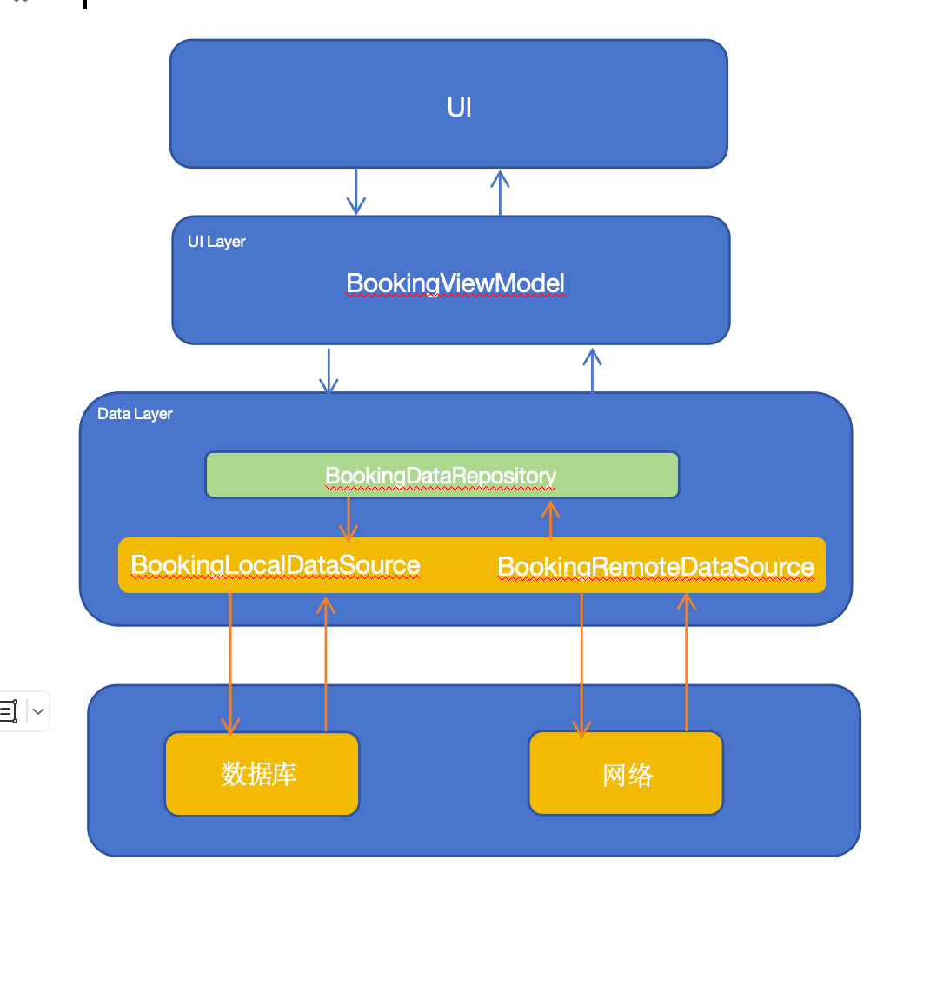
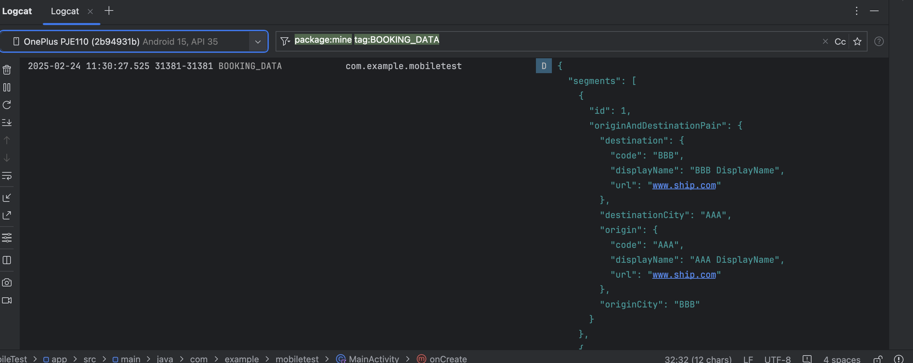

## MobileTest

#### 项目说明

本项目仅用于研究和学习交流，代码仅供参考，属于非商业用途项目

#### 项目架构

本项目遵循[Google官方推荐应用架构模型](https://developer.android.com/topic/architecture?hl=zh-cn&continue=https%3A%2F%2Fdeveloper.android.com%2Fcourses%2Fpathways%2Fandroid-architecture%3Fhl%3Dzh-cn%23article-https%3A%2F%2Fdeveloper.android.com%2Ftopic%2Farchitecture)，架构设计图如下：



#### 本地持久化缓存

采用Room数据库进行接口数据缓存，当数据超过有效期时，才进行本地缓存刷新，本地缓存通过单独的数据层进行管理，核心代码在`BookingLocalDataSource.kt`中。

#### 网路请求

采用Retrofit2+OkHttp实现网络请求，通过单独的数据层进行管理，核心代码在`BookingRemoteDataSource.kt`中

#### 数据刷新机制

由于数据存在时效性，在数据仍处于有效期内，应读取本地缓存，否则需要通过接口请求刷新数据，然后将数据缓存在本地，核心代码在`BookingDataRepository.kt`中：

```kotlin
val local = localDS.getBookingInfo()
val curTime = System.currentTimeMillis() / 1000L
val expireTime = local?.expiryTime?.toLong() ?: 0
val bookingInfo = if (curTime > expireTime) {
    // this data is expired, request new data from network.
    val remote = remoteDS.getBookingInfo()
    // allow to refresh after 5 seconds 
    remote.expiryTime = (curTime + 5).toString()
    // save new data into database and clear old data.
    localDS.deleteBookingInfo(local)
    localDS.deleteBookingList()
    localDS.insertBookingInfo(remote)
    remote
} else {
    // load data from database.
    local!!.copy(_segments = localDS.getBookingList())
}
```

#### 数据模拟

通过自定义OkHttp拦截器实现，模拟数据的json文件需要放在在`assets`目录下，核心代码在`ApiMock.kt`中：

```kotlin

val path = request.url().url().path.substring(1)
// 映射规则: 请求的url -> asset文件的路径
val file = mocks[path] ?: return null
// 优先读内存缓存，没有内存缓存则从`asset`目录下读取文件
val responseText = mockLruCaches[file]?.get() ?: let {
    val ins = application.assets.open(file)
    val json = BufferedReader(InputStreamReader(ins)).use {
        it.readText()
    }
    // 将json保存在内存中，这里使用了LruCache+SoftReference
    mockLruCaches.put(file, SoftReference(json))
    json
}
// 生成模拟数据的response实例
val responseBody = ResponseBody.create(
    MediaType.parse("application/json; charset=utf-8"),
    responseText
)
val response = Response.Builder()
    .protocol(Protocol.HTTP_1_1)
    .request(request)
    .message("OK")
    .code(200)
    .body(responseBody)
    .build()

```

#### 错误处理

通过自定义的MutableLiveData解决LiveData的“数据粘性”问题，使LiveData支持接收错误异常事件并通知更新UI：

```kotlin
private val _errorLD = NonStickyMutableLiveData<Throwable>()

bookingDataRP.getError()
	.flowOn(Dispatchers.IO)
 	.catch {
    // 通过“非粘性”的LiveData分发错误事件
    _errorLD.postValue(it)
  }
	.collectLatest {  }
```

实现“非粘性”LiveData的原理是通过修改LiveData的obserse方法，使Observer的版本号和LiveData的版本号一致，这样在调用observe方法时就不会下发UI刷新回调：

```kotlin
/**
 * “非粘性”状态的MutableLiveData，支持用于事件传递，可避免数据倒灌等情况发生
 * 主要特点是observe方法被调用时，不会回调onChanged事件
 */
class NonStickyMutableLiveData<T> : MutableLiveData<T> {
    constructor(): super()

    constructor(value: T): super(value)

    override fun observe(owner: LifecycleOwner, observer: Observer<in T>) {
        hook(observer)
        super.observe(owner, observer)
    }

    /**
     * 通过反射保持Observer的mLastVersion值与LiveData的值相同, 实现LiveData的“非粘性”状态
     * @param observer observer实例
     */
    private fun hook(observer: Observer<*>) {
        val classLiveData = LiveData::class.java
        val fieldObservers: Field = classLiveData.getDeclaredField("mObservers")
        fieldObservers.isAccessible = true
        val objectObservers: Any = fieldObservers.get(this) ?: return
        val classObservers: Class<*> = objectObservers.javaClass
        val methodGet: Method = classObservers.getDeclaredMethod("get", Any::class.java)
        methodGet.isAccessible = true
        val objectWrapperEntry: Any = methodGet.invoke(objectObservers, observer) ?: return
        var objectWrapper: Any? = null
        if (objectWrapperEntry is Map.Entry<*, *>) {
            objectWrapper = objectWrapperEntry.value
        }
        if (objectWrapper == null) {
            throw NullPointerException("Wrapper can not be bull!")
        }
        val classObserverWrapper: Class<*> = objectWrapper.javaClass.superclass ?: return
        val fieldLastVersion: Field = classObserverWrapper.getDeclaredField("mLastVersion")
        fieldLastVersion.isAccessible = true
        //get livedata's version
        val fieldVersion: Field = classLiveData.getDeclaredField("mVersion")
        fieldVersion.isAccessible = true
        val objectVersion: Any = fieldVersion.get(this) ?: return
        //set wrapper's version
        fieldLastVersion.set(objectWrapper, objectVersion)
    }
}
```

#### 查看日志

使用`BOOKING_DATA`标签可以查看打印的数据，相关代码请查看`MainActivity.kt`：

